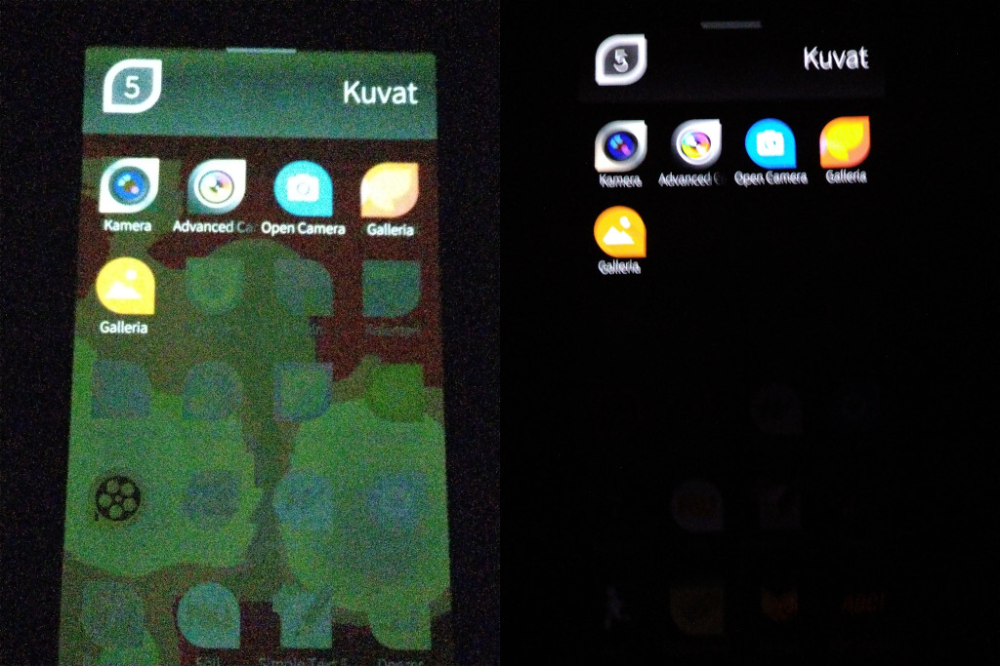

Brightness fix for Sony Xperia 10 III
-------------------------------------

See full discussion over at [Sailfish OS Forum](https://forum.sailfishos.org/t/x10ii-x10iii-color-banding-in-low-light-conditions/11659).

Sailfish OS (and some other AOSP-using operating systems too, I assume) running on Sony Xperia 10 III suffer from erroneous brightness/contrast/something behavior in certain circumstances. This can be best observed when going to a dark room and setting the device brightness to minimum. The screen is bright, but looks _hideous_.

To better illustrate, on the left is a photo of my Sony Xperia 10 III with ~5% brightness without the fix, and on the right is the same device with the same brightness, but with the fix:

That's not artefacts you see (ignore the noise though), that is what the human eye sees...

I stumbled upon `/sys/devices/dsi_panel_driver/hbm_mode` which can be used to mitigate the issue: writing `1`, waiting for 0.1 seconds (or more) and writing `0`, for whatever mind-boggling Sony-only-knows reason, fixes the brightness/contrast/something levels. JacekJagosz then wrote a shell script and a systemd service around that idea with a little help from nephros.

There is no fix yet (probably never will), but there are three workarounds:

The first one:

- Disable automatic screen brightness
- Set display to maximum brightness for a few seconds (this sets the `hbm_mode`)
- Wait until the brightness catches up and the screen "blinks"
- Set desired brightness
- The effect lasts until the screen turns off

The second one:

- Install [Brightness Magic](https://coderus.openrepos.net/pm2/project/patch-brightness-magic) patch by nephros
- Fix brightness by clicking the magic button in the top menu

The third one:

- Install this RPM :)

This RPM "fixes" the issue by enabling High Brightness Mode for 0.1 seconds after the screen has been turned on. The screen still blinks briefly, and is almost imperceptible under normal ambient room brightness levels. Until Sony fixes the issue, this is probably as good as it's going to get...
